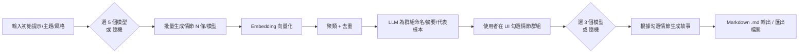
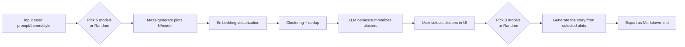

# 🧶 PlotWeaver
多模型生成大量情節 → LLM 分群歸納 → 使用者勾選 → 多模型生成完整故事（Markdown 輸出）

[](https://api.stima.tech)

---

## ✨ 核心功能

- **多模型情節生成**：同時使用最多 5 個不同的 LLM 模型生成多樣化的故事情節
- **智慧分類歸納**：使用 GPT 自動將相似情節分組，便於管理和選擇
- **互動式選擇**：使用者可勾選感興趣的情節群組來引導故事生成
- **協作式故事創作**：使用最多 3 個模型各自生成完整故事，創造更豐富的敘事
- **Markdown 輸出**：所有故事皆以簡潔的 Markdown 格式匯出
- **隨機模型選擇**：於情節生成、故事創作階段，提供隨機選擇模型選項，增加結果多樣性

### 工作流程



### 架構概覽
- Web UI：模型選擇、情節列表、群組卡片、勾選與故事預覽/匯出。
- Orchestrator：協調多模型呼叫、批次任務、重試與速率限制。
- Embeddings & Clustering：向量化、去重、聚類（k-means/HDBSCAN/閾值合併）。
- LLM Summarizer：為每個聚類群組命名、摘要、抽取代表情節。
- Exporter：Markdown 組版與檔案輸出。
- Storage：會話資料、配置與產出（JSON/SQLite/Postgres/檔案系統）。

### 快速開始

先決條件
- Node.js 18+（或以 Docker 執行）
- 建議使用 pnpm 或 yarn
- 至少一到多個 LLM/Embedding 服務的 API Key（例如 OpenAI/Anthropic/Google/Mistral...）

安裝
```bash
git clone <your-repo-url> plotweaver
cd plotweaver
cp .env.example .env
# 填入可用的 API Key（至少 1 家）
pnpm install
pnpm dev
# 開啟 http://localhost:3000
```

.env（範例）
```bash
# 至少填一項可用供應商
OPENAI_API_KEY=...
ANTHROPIC_API_KEY=...
GOOGLE_API_KEY=...
MISTRAL_API_KEY=...
AZURE_OPENAI_API_KEY=...
AZURE_OPENAI_ENDPOINT=...
GROQ_API_KEY=...

# Embedding（預設可用 OpenAI）
EMBEDDING_PROVIDER=openai
EMBEDDING_MODEL=text-embedding-3-large

# 儲存
DATA_DIR=./data
```

### 模型配置
models.config.json（範例）
```json
{
  "available": [
    { "id": "openai:gpt-4o-mini", "weight": 1 },
    { "id": "openai:o3-mini", "weight": 1 },
    { "id": "anthropic:claude-3-5-sonnet", "weight": 1 },
    { "id": "google:gemini-1.5-pro", "weight": 1 },
    { "id": "mistral:mistral-large", "weight": 1 },
    { "id": "groq:llama-3.1-70b", "weight": 0.5 },
    { "id": "ollama:llama3.1", "weight": 0.5 }
  ],
  "plotModelCount": 5,
  "storyModelCount": 3,
  "temperature": 0.8,
  "top_p": 0.95
}
```
- plotModelCount：第一次生成情節時固定挑選 5 個模型（或隨機依權重抽樣）。
- storyModelCount：生成故事時挑選 3 個模型（或隨機）。
- weight：控制隨機抽樣概率。

### 使用說明

Web UI
1) 生成情節  
- 選擇 5 個模型或按「隨機」  
- 輸入初始提示（題材、角色、世界觀、主題、長度等）  
- 設定每模型要產生的情節數量（例如每模型 20 條）  
- 執行後會得到大量情節列表

2) 分群/歸納  
- 選擇 Embedding 模型與聚類策略（自動/手動 k、或相似度閾值）  
- 系統去重並將相似情節合併  
- LLM 為每個群組命名與摘要，並挑選代表情節  
- UI 以群組卡片呈現，可展開查看群內樣本

3) 勾選群組  
- 勾選你想保留的群組（可多選）  
- 支援合併群組、拆分群組、重新命名群組

4) 生成故事  
- 選擇 3 個模型或按「隨機」  
- 可設定語氣、體裁、章節數、視角、敘事節奏等  
- 產生的故事以 Markdown 預覽

5) 匯出  
- 一鍵匯出 .md 檔或複製到剪貼簿  
- 會話資料保存於 DATA_DIR 以便重現

CLI（可選）
```bash
# 1) 批量生成情節
node scripts/generate-plots \
  --models openai:gpt-4o-mini,anthropic:claude-3-5-sonnet,google:gemini-1.5-pro,mistral:mistral-large,groq:llama-3.1-70b \
  --count-per-model 20 \
  --prompt "黑色奇幻、蒸汽龐克、女偵探、古城謎案、帶扭轉結局"

# 2) 分群
node scripts/cluster \
  --embedding openai:text-embedding-3-large \
  --method auto \
  --dedup-threshold 0.9

# 3) 生成故事（Markdown 輸出）
node scripts/generate-story \
  --models random:3 \
  --style "維多利亞風、第一人稱、分章敘事" \
  --out story.md
```

### 聚類與去重建議
- 向量相似度：cosine similarity
- 去重：相似度 > 0.9 視為高度重複
- 聚類：k-means（k 自動以 silhouette score 探索）、或使用 HDBSCAN（適合密度不均）
- 群組命名/摘要：LLM 對每群組的代表樣本做摘要與命名

### 範例 Prompt

情節生成（每模型）
```
你是資深故事設計師。請依下列設定，產生 1 條具有「衝突—轉折—餘韻」的原創情節：
- 題材/風格：{風格}
- 主題：{主題}
- 世界觀與限制：{世界觀}
- 角色：{角色列表}
- 語氣：{語氣}
輸出格式：
- 標題：
- 一句話鉤子：
- 三幕要點：
- 主要意象/母題：
- 潛在反轉：
- 延伸可能（可選）：
```

故事生成（多模型）
```
你是小說家。請基於以下「已選情節群組摘要」創作一篇完整故事：
- 風格/體裁：{體裁}
- 章節數：{章節}
- 角色視角：{視角}
- 主題與母題：{母題}
- 必須融入的情節要素（來自群組摘要）：{要素列表}

請以 Markdown 輸出，包含：
- 封面標題
- 前言/引子
- 分章（#、##、### 結構清晰）
- 關鍵對話與意象
- 收尾與餘韻
```

### 專案路線圖
- [ ] 章節級重寫/潤稿（以已選群組為約束）
- [ ] 多語言故事輸出
- [ ] 模型投票/合成策略（RAG、最終決選、叢集綜述）
- [ ] 更彈性的 UI 群組操作（合併、拆分、標記）
- [ ] 成本控管與速率限制面板

### 貢獻
歡迎 Issue/PR！請遵循 Conventional Commits 與簡單的 PR 描述。

### 授權
MIT

---

## English

A prototyping project for creators and studios: generate a large pool of plots with multiple models, cluster and summarize via LLM, let users select clusters, then weave them into a full story with multiple models and export as Markdown.

> Note: We use “PlotWeaver” as a placeholder name. Feel free to rename it.

### Features
- Multi-model plot generation: pick 5 models (or Random) for the first pass.
- LLM grouping and summaries: embedding + clustering + GPT/LLM naming and representative summaries.
- User-driven selection: cluster cards/list with preview, multi-select, merge/split.
- Multi-model story generation: pick 3 models (or Random) to produce the final story in Markdown.
- Reproducibility and controls: seed, temperature, top_p, weighted random, dedup threshold.
- Pluggable model connectors: OpenAI, Anthropic, Google, Mistral, Azure OpenAI, Groq, Ollama (local).

### Workflow



### Architecture
- Web UI: model picker, plot lists, cluster cards, selection, preview/export.
- Orchestrator: multi-model calls, batching, retries, rate limiting.
- Embeddings & Clustering: vectorization, dedup, k-means/HDBSCAN/threshold merge.
- LLM Summarizer: cluster naming, summaries, representative plot extraction.
- Exporter: Markdown formatting and file export.
- Storage: sessions, config, outputs (JSON/SQLite/Postgres/filesystem).

### Getting Started

Requirements
- Node.js 18+ (or run via Docker)
- pnpm or yarn recommended
- One or more LLM/Embedding API keys (OpenAI/Anthropic/Google/Mistral...)

Install
```bash
git clone <your-repo-url> plotweaver
cd plotweaver
cp .env.example .env
# Fill in one or more API keys
pnpm install
pnpm dev
# Open http://localhost:3000
```

.env example
```bash
OPENAI_API_KEY=...
ANTHROPIC_API_KEY=...
GOOGLE_API_KEY=...
MISTRAL_API_KEY=...
AZURE_OPENAI_API_KEY=...
AZURE_OPENAI_ENDPOINT=...
GROQ_API_KEY=...

EMBEDDING_PROVIDER=openai
EMBEDDING_MODEL=text-embedding-3-large

DATA_DIR=./data
```

### Model Configuration
models.config.json
```json
{
  "available": [
    { "id": "openai:gpt-4o-mini", "weight": 1 },
    { "id": "openai:o3-mini", "weight": 1 },
    { "id": "anthropic:claude-3-5-sonnet", "weight": 1 },
    { "id": "google:gemini-1.5-pro", "weight": 1 },
    { "id": "mistral:mistral-large", "weight": 1 },
    { "id": "groq:llama-3.1-70b", "weight": 0.5 },
    { "id": "ollama:llama3.1", "weight": 0.5 }
  ],
  "plotModelCount": 5,
  "storyModelCount": 3,
  "temperature": 0.8,
  "top_p": 0.95
}
```
- plotModelCount: select 5 models for plot generation (or weighted random).
- storyModelCount: select 3 models for story generation (or random).
- weight controls random sampling probability.

### Usage

Web UI
1) Generate plots  
- Pick 5 models or click Random  
- Enter initial prompt (genre, characters, world, theme, length)  
- Set plots per model (e.g., 20)  
- Run to produce a large plot pool

2) Cluster & summarize  
- Choose embedding model and clustering strategy (auto/manual k, or similarity threshold)  
- Deduplicate and group similar plots  
- LLM names/summarizes each cluster and selects representatives  
- UI shows cluster cards with expandable samples

3) Select clusters  
- Multi-select clusters to keep  
- Merge/split/rename if needed

4) Generate story  
- Pick 3 models or Random  
- Configure tone, genre, chapters, POV, pacing  
- Story preview renders as Markdown

5) Export  
- Export as .md or copy to clipboard  
- Sessions are saved under DATA_DIR for reproducibility

CLI (optional)
```bash
# 1) Mass-generate plots
node scripts/generate-plots \
  --models openai:gpt-4o-mini,anthropic:claude-3-5-sonnet,google:gemini-1.5-pro,mistral:mistral-large,groq:llama-3.1-70b \
  --count-per-model 20 \
  --prompt "Dark fantasy, steampunk, female detective, ancient city mystery, twist ending"

# 2) Cluster
node scripts/cluster \
  --embedding openai:text-embedding-3-large \
  --method auto \
  --dedup-threshold 0.9

# 3) Generate story (Markdown)
node scripts/generate-story \
  --models random:3 \
  --style "Victorian, first-person, multi-chapter" \
  --out story.md
```

### Clustering & Dedup Guidelines
- Similarity metric: cosine similarity
- Dedup: similarity > 0.9 considered near-duplicate
- Clustering: k-means with auto-k via silhouette score, or HDBSCAN for uneven density
- Cluster labeling/summaries: LLM over representative samples

### Prompt Templates

Plot generation (per model)
```
You are a senior narrative designer. Produce 1 original plot with Conflict–Reversal–Resonance:
- Genre/Style: {style}
- Theme: {theme}
- World constraints: {world}
- Characters: {characters}
- Tone: {tone}
Output:
- Title:
- One-line hook:
- Three-act beats:
- Key motifs:
- Potential twist:
- Extensions (optional):
```

Story generation (multi-model)
```
You are an author. Based on the following "selected cluster summaries", write a complete story:
- Genre: {genre}
- Chapters: {chapters}
- POV: {pov}
- Themes/Motifs: {motifs}
- Required plot elements (from clusters): {elements}

Output in Markdown with:
- Title (H1)
- Prologue/Hook
- Chapters with clear #/##/### structure
- Key dialogues and imagery
- Ending with resonance
```

### Roadmap
- [ ] Chapter-level rewriting/polish constrained by selected clusters
- [ ] Multilingual story output
- [ ] Model voting/ensemble (RAG, final arbitration, cluster synthesis)
- [ ] Richer UI for cluster operations (merge/split/labels)
- [ ] Cost and rate-limit dashboard
- [ ] Offline/local mode (Ollama + local embeddings)

### Contributing
Issues and PRs welcome! Please follow Conventional Commits and add a brief PR description.

### License
MIT

---

需要我把這份 README 直接轉成 README.md，或幫你挑一個專案名稱與簡單 Logo 嗎？


我幫您創建專業的 GitHub README 文件：

## 英文版 README.md

```markdown
# Story Generator Hub

🎭 A multi-model collaborative story generation platform powered by various LLMs

## 📖 Overview

Story Generator Hub is an innovative platform that leverages multiple Large Language Models (LLMs) to generate diverse story plots, intelligently categorize them, and create complete stories based on user preferences.

## ✨ Features

- **Multi-Model Plot Generation**: Generate diverse story plots using up to 5 different LLM models simultaneously
- **Intelligent Clustering**: Automatically group similar plots using GPT for better organization
- **Interactive Selection**: Users can select preferred plot clusters to guide story generation
- **Collaborative Story Creation**: Generate complete stories using up to 3 models for richer narratives
- **Markdown Export**: All stories are exported in clean Markdown format
- **Random Model Selection**: Option to randomly select models for varied results

## 🚀 How It Works

### Phase 1: Plot Generation
1. Select up to 5 LLM models (or choose random selection)
2. Generate multiple story plots from each model
3. GPT analyzes and clusters similar plots automatically

### Phase 2: Plot Selection
1. Review categorized plot clusters
2. Select preferred plot groups
3. Confirm selections for story generation

### Phase 3: Story Generation
1. Choose up to 3 models for story generation (or random)
2. Generate complete stories based on selected plots
3. Export stories in Markdown format

## 🛠️ Technology Stack

- **Frontend**: [Your frontend framework]
- **Backend**: [Your backend framework]
- **LLM Integration**: Multiple model APIs (GPT, Claude, Gemini, etc.)
- **Classification Engine**: GPT for plot clustering and categorization

## 📦 Installation

```bash
# Clone the repository
git clone https://github.com/yourusername/story-generator-hub.git

# Navigate to project directory
cd story-generator-hub

# Install dependencies
npm install

# Set up environment variables
cp .env.example .env
# Add your API keys to .env

# Start the application
npm start
```

## 🔧 Configuration

Create a `.env` file with the following variables:

```env
OPENAI_API_KEY=your_openai_key
ANTHROPIC_API_KEY=your_anthropic_key
GOOGLE_AI_KEY=your_google_key
# Add other model API keys as needed
```

## 📝 Usage

1. **Initial Setup**: Configure your preferred LLM models in settings
2. **Generate Plots**: Click "Generate Plots" and select your models
3. **Review & Select**: Browse categorized plots and select interesting ones
4. **Generate Story**: Choose models and generate your complete story
5. **Export**: Download your story in Markdown format

## 🤝 Contributing

We welcome contributions! Please see our [Contributing Guide](CONTRIBUTING.md) for details.

## 📄 License

This project is licensed under the MIT License - see the [LICENSE](LICENSE) file for details.

## 🙏 Acknowledgments

- Thanks to all LLM providers for their APIs
- Community contributors and testers
- Open source libraries used in this project

## 📧 Contact

- Project Link: [https://github.com/yourusername/story-generator-hub](https://github.com/yourusername/story-generator-hub)
- Issues: [https://github.com/yourusername/story-generator-hub/issues](https://github.com/yourusername/story-generator-hub/issues)
```

## 中文版 README_zh-TW.md

```markdown
# Story Generator Hub 故事生成器中心

🎭 基於多個大型語言模型協作的故事生成平台

## 📖 專案簡介

Story Generator Hub 是一個創新的故事生成平台，透過整合多個大型語言模型（LLM）來生成多樣化的故事情節，並智慧分類歸納，最終根據使用者偏好創作完整的故事。

## ✨ 核心功能

- **多模型情節生成**：同時使用最多 5 個不同的 LLM 模型生成多樣化的故事情節
- **智慧分類歸納**：使用 GPT 自動將相似情節分組，便於管理和選擇
- **互動式選擇**：使用者可勾選感興趣的情節群組來引導故事生成
- **協作式故事創作**：使用最多 3 個模型生成完整故事，創造更豐富的敘事
- **Markdown 輸出**：所有故事皆以簡潔的 Markdown 格式匯出
- **隨機模型選擇**：提供隨機選擇模型選項，增加結果多樣性

## 🚀 運作流程

### 第一階段：情節生成
1. 選擇最多 5 個 LLM 模型（或選擇隨機）
2. 每個模型生成多個故事情節
3. GPT 自動分析並將相似情節分類

### 第二階段：情節篩選
1. 瀏覽分類後的情節群組
2. 勾選偏好的情節群組
3. 確認選擇以進行故事生成

### 第三階段：故事生成
1. 選擇最多 3 個模型進行故事生成（或隨機）
2. 基於選定情節生成完整故事
3. 以 Markdown 格式匯出故事

## 🛠️ 技術架構

- **前端框架**：[您的前端框架]
- **後端框架**：[您的後端框架]
- **LLM 整合**：多個模型 API（GPT、Claude、Gemini 等）
- **分類引擎**：GPT 負責情節分類和歸納

## 📦 安裝指南

```bash
# 複製專案
git clone https://github.com/yourusername/story-generator-hub.git

# 進入專案目錄
cd story-generator-hub

# 安裝依賴套件
npm install

# 設定環境變數
cp .env.example .env
# 在 .env 中加入您的 API 金鑰

# 啟動應用程式
npm start
```

## 🔧 環境設定

建立 `.env` 檔案並加入以下變數：

```env
OPENAI_API_KEY=your_openai_key
ANTHROPIC_API_KEY=your_anthropic_key
GOOGLE_AI_KEY=your_google_key
# 根據需要加入其他模型的 API 金鑰
```

## 📝 使用說明

1. **初始設定**：在設定中配置您偏好的 LLM 模型
2. **生成情節**：點擊「生成情節」並選擇模型
3. **檢視與選擇**：瀏覽分類後的情節並勾選感興趣的項目
4. **生成故事**：選擇模型並生成完整故事
5. **匯出**：以 Markdown 格式下載您的故事

## 🤝 貢獻指南

歡迎貢獻！詳細資訊請參閱 [貢獻指南](CONTRIBUTING.md)。

## 📄 授權條款

本專案採用 MIT 授權條款 - 詳見 [LICENSE](LICENSE) 檔案。

## 🙏 致謝

- 感謝所有 LLM 提供商的 API 支援
- 社群貢獻者和測試人員
- 本專案使用的開源函式庫

## 📧 聯絡方式

- 專案連結：[https://github.com/yourusername/story-generator-hub](https://github.com/yourusername/story-generator-hub)
- 問題回報：[https://github.com/yourusername/story-generator-hub/issues](https://github.com/yourusername/story-generator-hub/issues)
```

這兩個版本的 README 都包含了您專案的核心概念，並以專業的格式呈現。您可以根據實際的技術選擇和專案名稱進行調整。需要我協助您添加其他章節或調整內容嗎？
